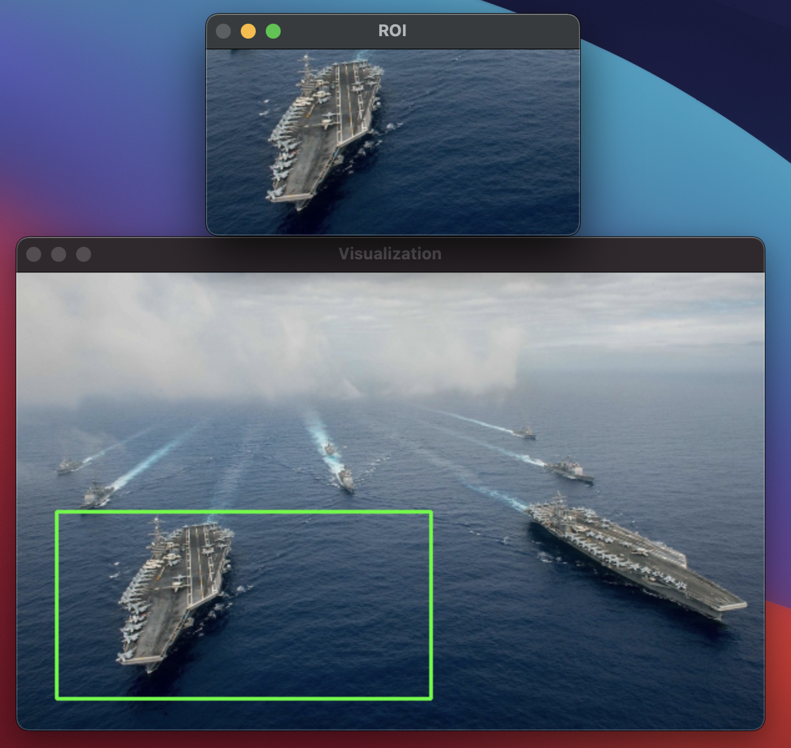
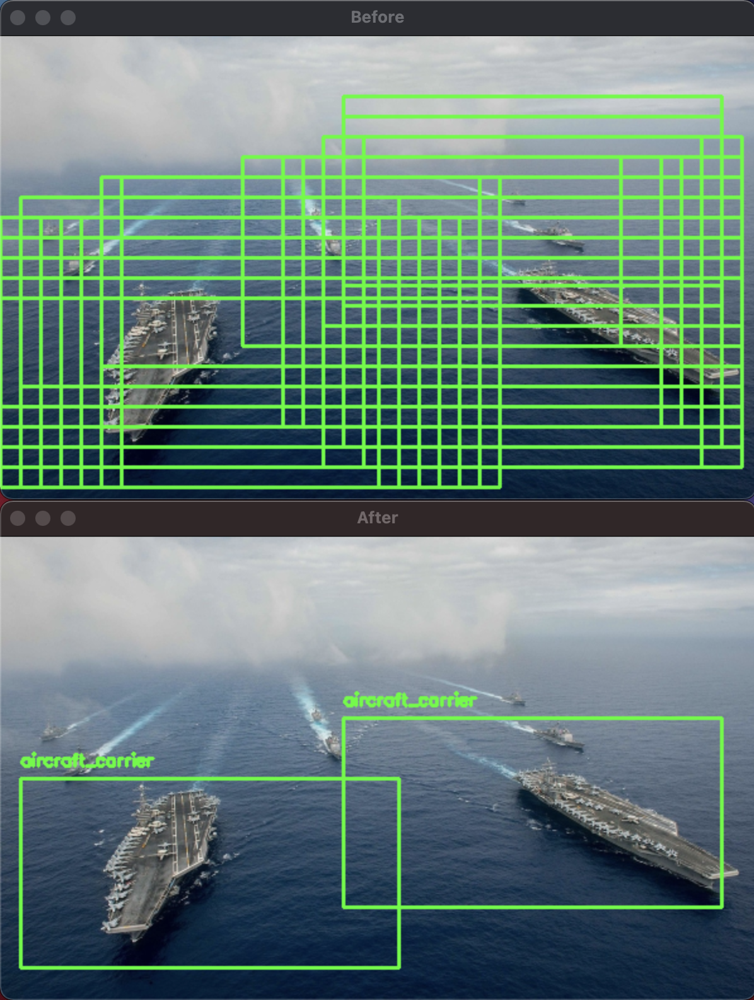
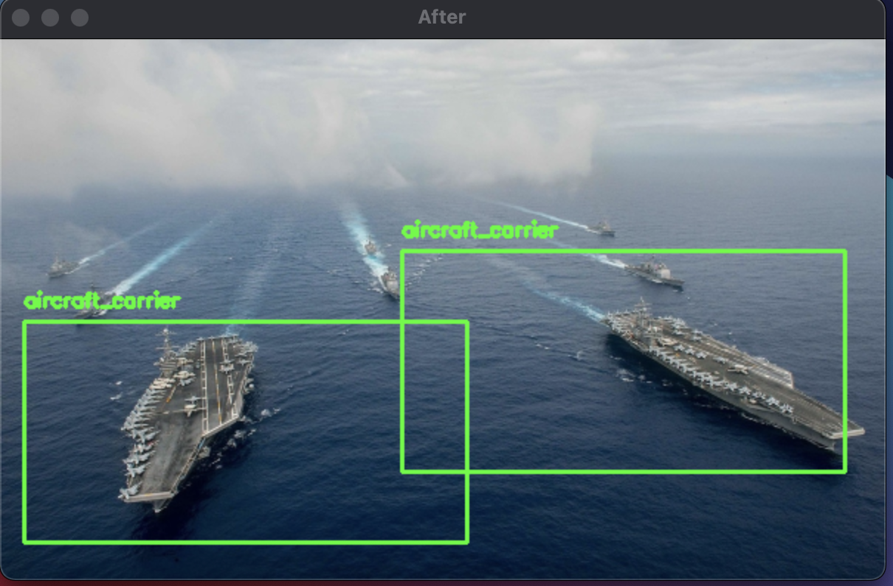

# Turn CNN image classifier into Object Detector with Keras, TensorFlow and OpenCV

Pretrained image classifier
- image pyramids to generate copies at different scales to find objects of different size
- sliding windows to find where the image is from left-to-right and top-to-bottom
- non-maxima supression to combine weaker bounding boxes for stronger bounding boxes

Image Classifier = given an input passed through a NN we obtain a single class label and probability associated.
- One image in
- One class label out

Object Detection = given an input passed through a NN we obtain what the is in the image (class label) and where in the image the object is via x,y bounding box
- Input one image
- Obtain multiple bounding box and class labels

Object Detection Algorithm ingredients:
1. Input: image
1. Output: 3x values
    - list of bounding boxes (x, y) coordinates
    - class label with each bounding box
    - probability/confidence score with each bounding box

USing HOG + Linear SVM to detect objects

Using image pyramids we find objects in images at different scales

The bottomm of the pyramid is the original image and size

The image is progressively subsampled until criteria met
1. Extract the ROI
1. Pass through Image Classifier
1. Obtain predictions
1. non-maxima supression to collapse bounding boxes

Procedure
1. Input image
1. Construct image pyramid
1. Run sliding window at each scale of image pyramid
1. For each step of sliding window, extract ROI
1. Take ROI and pass it through CNN for classification
1. If min probability test passes, record class label and bounding box
1. Apply class-wise NMS to bounding boxes
1. Return results

Problem
1. slow
1. low accuracy
1. not end-to-end trainable 